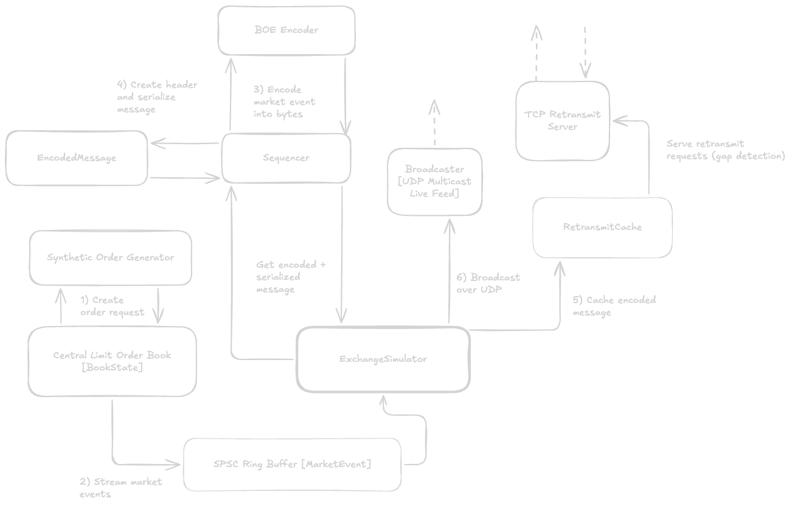

# hft-architecture
A complete low-latency algorithmic trading pipeline, consisting of an exchange simulator, market data handler, limit order book, passive market maker strategy process with pre-trade risk checks, and a paper OMS.

## Exchange Simulator
The exchange simulator generates and publishes market events over UDP multicast, running on three separate threads:
1. A configurable __synthetic order generator__ publishes order requests to the exchange's __matching engine__, which publishes the corresponding market events to a __lock-free SPSC ring buffer__.
2. The exchange simulator's __orchestrator__ reads these market events, passes them to a __sequencer__ which encodes the messages into a custom __BOE format__, stamps a sequencer number and header, and serializes the entire message. The orchestrator caches this encoded message on a thread-safe circular cache, and forwards it to the __UDP broadcaster__ to send over UDP multicast.
3. The asynchronous, I/O-multiplexed __TCP retransmit server__ handles client connections, retreives and corresponding cached packets, and transmits them over the TCP connection.

## Market Data Handler
Currently working on this.

## Run and Execute
> [!WARNING]
> The exchange's TCP retransmit server uses `kqueue` to pool many connections on a single thread. This requires macOS or BSD and will _not_ work on Linux. If you wish to run the repo in Linux, you will need to refactor the simulator and remove the retransmit server, or use `epoll` instead.
> Further, the pipeline makes use of several ARM64 instructions to optimize spin waiting on ARM systems, and is optimized for Apple Silicon (e.g. with thread affinity, using 128-byte cache lines to prevent false sharing on Apple's performance cores, etc.) and may not perform as well on other systems.

A Makefile has been provided for convenience:
1. Clone the repo.
2. Edit `includes/config.hpp` as desired. By default, `LOGGING` is enabled. You may need to edit the UDP MCAST interface or other network details.
3. Run `make bin/exchange` run `./bin/exchange`
4. Press `CTRL + C` to stop.

