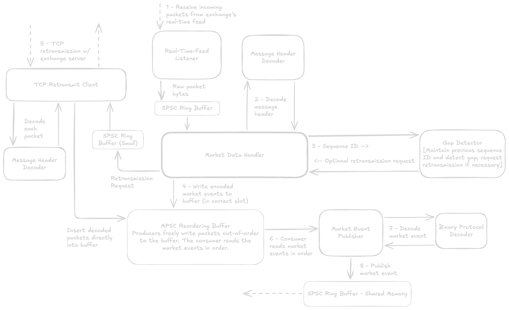

# C++ Low-Latency HFT Architecture
A complete low-latency algorithmic trading pipeline, consisting of an exchange simulator, market data handler, limit order book, passive market maker strategy process with pre-trade risk checks, and a paper OMS.

## Exchange Simulator
The exchange simulator generates and publishes market events over UDP multicast, running on three separate threads:
1. A configurable __synthetic order generator__ publishes order requests to the exchange's __matching engine__, which publishes the corresponding market events to a lock-free SPSC ring buffer.
2. The exchange simulator's __orchestrator__ reads these market events, passes them to a __sequencer__ which encodes the messages into a custom __binary protocol__, stamps a sequencer number and header, and serializes the entire message. The orchestrator caches this encoded message on a thread-safe circular cache, and forwards it to the __UDP broadcaster__ to send over UDP multicast.
3. The asynchronous, I/O-multiplexed __TCP retransmit server__ handles client connections, retreives and corresponding cached packets, and transmits them over the TCP connection.

## Market Data Handler
The market data handler retreives and processes market events from the exchange, running across four threads:
1. A __real-time feed listener__ listens for packets broadcast by the exchange over UDP multicast, and directly places the packets from the kernel's buffer into a lock-free SPSC ring buffer.
2. The __market data handler__ reads these packets, decodes their headers, passes them to a __gap detector__, and writes a retransmit request to a lock-free SPSC ring buffer if necessary. It then immediately writes the packet to the __reorder buffer__.
3. The __TCP retransmit client__ spins on the lock-free SPSC ring buffer until it receives a request, then forwards this request to the exchange's retransmit server, receives and decodes the packet headers, and places them directly in the reorder buffer.
4. The __market event publisher__ spins on the reorder buffer, waiting for the next packet's data. When available, it pulls this packet's data from the reorder buffer, decodes the market event, and pushes the market event to a lock-free SPSC ring buffer.

## Run and Execute
> [!WARNING]
> The exchange's TCP retransmit server uses `kqueue` to pool many connections on a single thread. This requires macOS or BSD and will _not_ work on Linux. If you wish to run the repo in Linux, you will need to refactor the simulator and remove the retransmit server, or use `epoll` instead.
> Further, the pipeline makes use of several ARM64 instructions to optimize spin waiting on ARM systems, and is optimized for Apple Silicon (e.g. with thread affinity, using 128-byte cache lines to prevent false sharing on Apple's performance cores, etc.) and may not perform as well on other systems.

A Makefile has been provided for convenience:
1. Clone the repo.
2. Edit `includes/config.hpp` as desired. By default, `LOGGING` is enabled. You may need to edit the UDP MCAST interface or other network details.
3. Run `make bin/exchange-market-data` run `./bin/exchange-market-data`. Alternatively, run `./bin/exchange` to start the exchange, and `./bin/market-handler` to separately start the market data handler.
4. Press `CTRL + C` to stop.